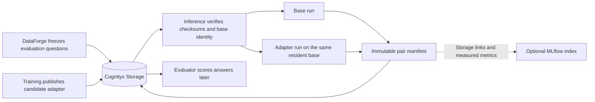

# Training adapters and paired research runs

## Why this exists

Training produces a small set of learned weights that modify a base model. That
small set of weights is called an adapter. This repository verifies a Training
adapter, applies it to the already loaded base model, and records what happened.
It does not train the adapter and it does not judge whether an answer is correct.

The purpose is to make a base-versus-adapter comparison repeatable. For every
frozen question, both sides use the same base model, runtime, decoding settings,
record order, and prompt behavior. Only the adapter may differ.

## Place in the Cognityx application



Ownership is deliberately narrow:

- DataForge owns frozen evaluation data.
- Training owns adapter production and the adapter manifest.
- Inference verifies, executes, and records predictions and runtime evidence.
- Evaluator owns correctness, scoring, and statistical comparison.
- Cognityx Storage is the authoritative result. MLflow is a secondary search and
  live-observability index.
- Publishing a Git research snapshot is a separate future task.

## Adapter handoff

The first-class input is a Storage URI ending in `adapter-manifest.json`, for
example `storage://local-main/models/adapters/.../adapter-manifest.json`.
Arbitrary local PEFT directories are not accepted as research-grade inputs.

Inference consumes the current Training schema
`cognityx.training.adapter/v1`. It verifies:

- schema, candidate status, adapter and Training IDs;
- base-model name, requested and resolved revisions, tokenizer revision, and
  chat-template checksum when each side supplies them;
- PEFT LoRA or QLoRA configuration;
- required files, file sizes, SHA-256 checksums, `checksums.json`, and the bundle
  checksum;
- dataset IDs, manifest/checksum references, records checksum, and recipe.

Storage resolves the URI and materializes the files. Inference does not rebuild
a physical path. The local cache directory is named by the verified bundle
checksum, so reusing identical immutable content does not create a new
scientific identity.

Known mismatches fail before generation. A genuinely unavailable identity is
reported as `unverified`; it is never presented as a match. Stable error codes
include:

- `adapter_manifest_invalid`
- `adapter_artifact_missing`
- `adapter_checksum_mismatch`
- `adapter_base_model_mismatch`
- `adapter_tokenizer_mismatch`
- `adapter_chat_template_mismatch`
- `adapter_not_supported`

The vLLM backend enables LoRA support when the resident base is loaded. An
adapted request supplies exactly one vLLM `LoRARequest`; a base request supplies
none. The process-local numeric ID is derived from verified content and is only
an implementation detail. Scientific identity remains the Training
`adapter_id`, manifest checksum, and bundle checksum. Transformers and remote
providers reject adapter selection explicitly.

## Normal inference request

Adapters are additive to the existing request contract and require an explicit
evaluation purpose:

```bash
uv run cognityx-inference infer \
  --base-url http://127.0.0.1:8013 \
  --model Qwen/Qwen3-8B \
  --model-revision REPLACE_WITH_BASE_COMMIT \
  --backend vllm \
  --profile int4 \
  --adapter-manifest storage://local-main/models/REPLACE_WITH_ADAPTER/adapter-manifest.json \
  --adapter-purpose evaluation \
  --prompt "Reply with one short sentence." \
  --max-output-tokens 64 \
  --no-stream
```

The same fields are available as `adapter_manifest_uri` and
`adapter_purpose="evaluation"` in `InferenceRequest`, the Python client, and the
`cognityx` object in `POST /v1/chat/completions`.

## Thinking and controlled generation

Some models can spend generated tokens reasoning before they give a final
answer. Cognityx calls this behavior thinking. It is disabled by default so a
short factual evaluation does not accidentally spend its whole output allowance
inside a reasoning section. Use `--thinking` or `thinking="enabled"` when an
experiment deliberately studies that behavior; `--no-thinking` is the explicit
disabled form.

For the current Qwen3 tokenizer, Cognityx passes the model-native
`enable_thinking` value into the active chat template. Disabled Qwen3 prompts
contain the template's empty `<think>...</think>` transition before the answer;
enabled prompts leave the model free to produce the reasoning section. Cognityx
does not remove reasoning text after generation and does not pretend an
unsupported backend has this control. Explicitly enabling thinking on an
unsupported backend or model fails before generation.

The response and runtime fingerprint record the requested mode, effective mode,
and result-changing mechanism. Both arms of a research pair receive one shared
thinking setting, and pair validation rejects different effective fingerprints.
Prediction rows retain this evidence together with `finish_reason`. In
particular, `finish_reason="length"` means the candidate exhausted its output
allowance; a later Evaluator can classify that output as truncated without
Inference attempting a correctness score.

The general inference API keeps its existing configurable output behavior. The
controlled research-pair default is 512 output tokens. Existing certified
context budgeting still verifies that input tokens, the requested output, and
the safety reserve fit the certified context; this change does not increase the
certified 40,960-token Qwen3-8B boundary.

## Immutable run and pair records

An Inference Run (`cognityx.inference.run/v1`) is one batch over a frozen input.
Predictions are written first as JSON Lines, meaning one JSON object per line.
The run manifest is written last and contains its checksum and the prediction
URI/checksum. A missing terminal manifest therefore cannot look completed.

A paired run (`cognityx.inference.pair/v1`) executes:

1. every evaluation row through the base model;
2. the same row IDs and order through one verified adapter;
3. a comparison of all result-changing runtime fingerprint fields;
4. a terminal pair manifest only when validation passes.

The fingerprint records measured or resolved values only: base and tokenizer
identity, chat-template checksum, backend and version, load/runtime settings,
vLLM engine details, quantization and data type, context and KV-cache settings,
effective generation settings, seed, stop strings, prompt behavior, relevant
package versions, and the Inference Git revision when available.

Prediction rows retain the evaluation record ID, question, supplied reference
answer, source IDs, fact/knowledge-unit IDs, evidence metadata, generated
answer, token/timing measurements, fingerprint checksum, and optional adapter
identity. Inference deliberately does not add a correctness score.

Storage layout:

```text
artifacts/inference/research/
  runs/<inference_run_id>/
    predictions.jsonl
    manifest.json
  pairs/<inference_pair_id>/
    manifest.json
    failure.json  # only when execution or pair validation fails
```

## Optional MLflow index

Tracking is off by default. Enable the optional dependency and configure the
same experiment name used by Training:

```bash
uv sync --extra api --extra telemetry --extra tracking
```

```toml
[tracking]
backend = "mlflow"
tracking_uri = "http://127.0.0.1:5000"
experiment_name = "cognityx-research"
failure_policy = "warn"
```

Inference logs Cognityx lineage tags, measured aggregate metrics, and Storage
URI/checksum references. It does not upload duplicate prediction files or
adapter weights. With the default `warn` policy, MLflow failure is diagnostic
and a valid Storage publication remains complete. Set `failure_policy="error"`
when the caller requires tracking success too.

## RTX 5090 Qwen3-8B smoke test

Do not run this until the Qwen3-8B base commit, the compatible E3/LunaVane
adapter manifest, and a tiny frozen evaluation manifest have been identified.
From the Inference checkout, replace the URI, commit, and experiment
placeholders:

```bash
export COGNITYX_INFERENCE_URL=http://127.0.0.1:8013
export COGNITYX_JOBS_DATABASE="$PWD/cognityx_jobs.sqlite3"
export BASE_REVISION=REPLACE_WITH_ADAPTER_BASE_COMMIT
export ADAPTER_MANIFEST_URI=storage://local-main/models/REPLACE_WITH_E3_LUNAVANE_ADAPTER/adapter-manifest.json
export EVALUATION_MANIFEST_URI=storage://local-main/datasets/REPLACE_WITH_TINY_EVALUATION/manifest.json
export EXPERIMENT_ID=REPLACE_WITH_SHARED_EXPERIMENT_ID

uv sync --locked --extra api --extra telemetry --extra tracking
uv run cognityx-inference serve --host 127.0.0.1 --port 8013
```

In a second terminal with the same exported values:

```bash
uv run cognityx-inference research pair \
  --base-url "$COGNITYX_INFERENCE_URL" \
  --evaluation-manifest "$EVALUATION_MANIFEST_URI" \
  --adapter-manifest "$ADAPTER_MANIFEST_URI" \
  --model Qwen/Qwen3-8B \
  --model-revision "$BASE_REVISION" \
  --backend vllm \
  --profile int4 \
  --experiment-id "$EXPERIMENT_ID" \
  --comparison-id qwen3-8b-e3-lunavane-smoke \
  --seed 0 \
  --temperature 0 \
  --top-p 1 \
  --no-thinking \
  --max-output-tokens 512 \
  --format json

uv run cognityx-inference infer \
  --base-url "$COGNITYX_INFERENCE_URL" \
  --model Qwen/Qwen3-8B \
  --model-revision "$BASE_REVISION" \
  --backend vllm \
  --profile int4 \
  --prompt "Reply with BASE DESELECTED." \
  --max-output-tokens 16 \
  --no-stream

uv run cognityx-inference model status \
  --base-url "$COGNITYX_INFERENCE_URL" \
  --format json
```

The evidence to inspect is: adapter verification metadata, one resident base
status, base and adapter predictions, equal pair fingerprint checksums, two run
manifests, one passed pair manifest, the later base response without adapter
identity, and MLflow tags pointing to the same Storage objects. This smoke test
does not support a performance or quality conclusion.

To recheck only the installed vLLM API before loading weights:

```bash
.venv-vllm/bin/python -c "import inspect; from vllm import LLM; from vllm.engine.arg_utils import EngineArgs; from vllm.lora.request import LoRARequest; assert 'enable_lora' in inspect.signature(EngineArgs).parameters; assert 'lora_request' in inspect.signature(LLM.generate).parameters; assert {'lora_name','lora_int_id','lora_path'} <= set(inspect.signature(LoRARequest).parameters); print('vLLM LoRA API compatible')"
```

## Known producer gap

The current Training adapter manifest preserves dataset lineage but does not
publish a research-package ID/URI/checksum or a separate tokenizer name. This
implementation does not guess them. A small future Training change should add
those optional references to the public adapter schema; older v1 manifests can
remain valid and report the missing identity as unavailable.
