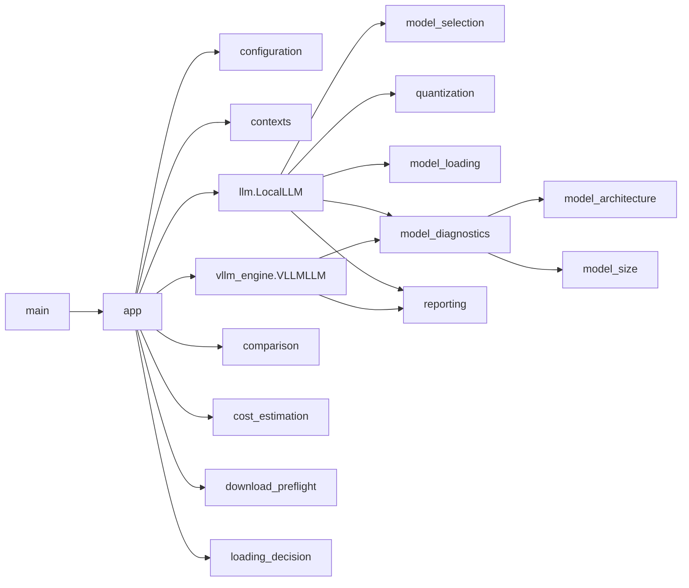
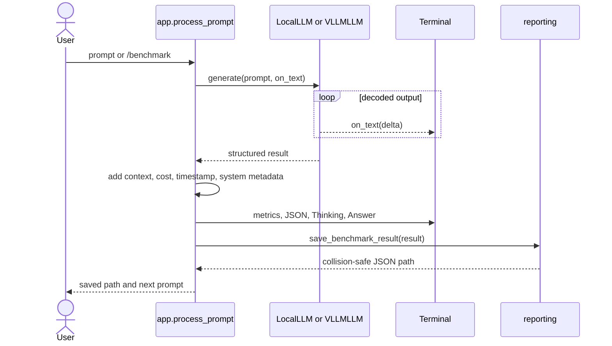
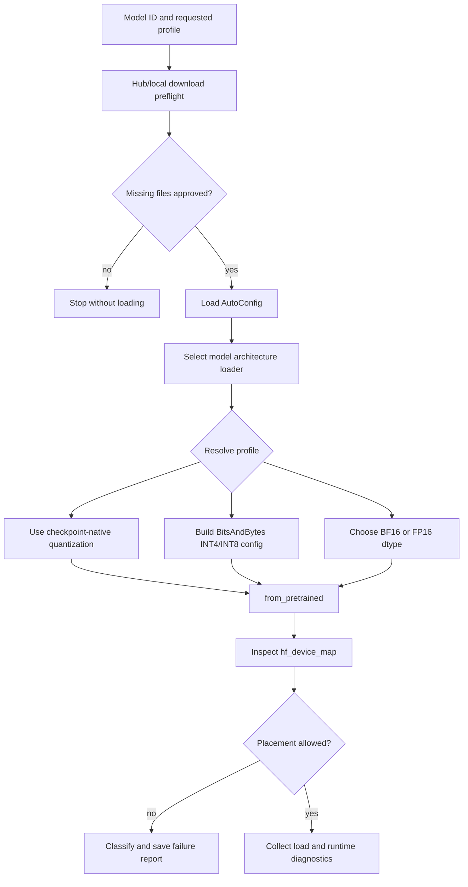
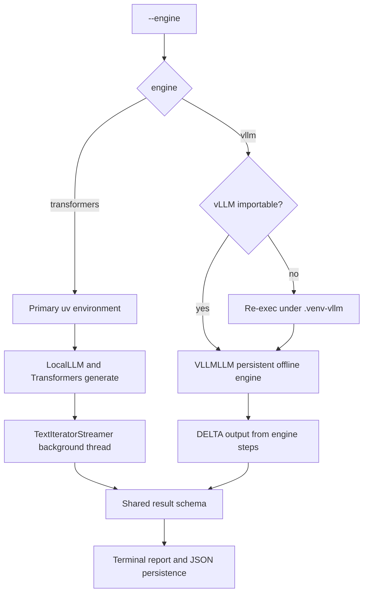
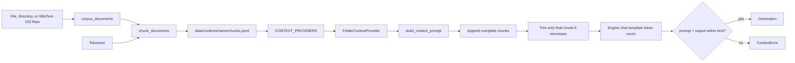
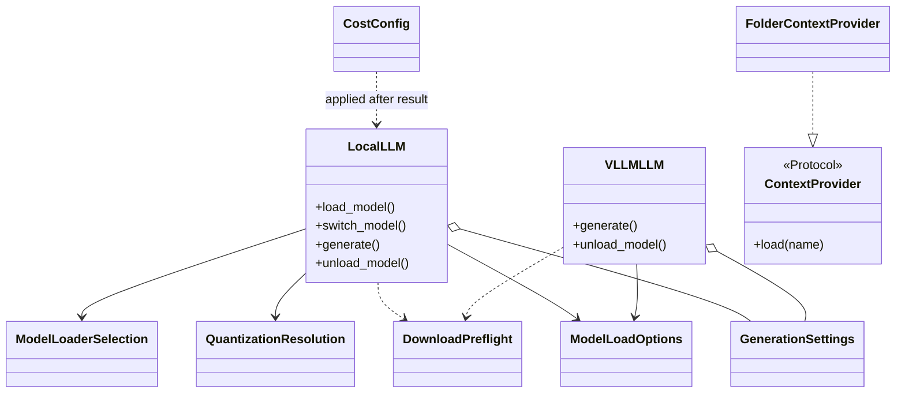

# Architecture blueprint

## High-level module dependencies

`main.py` modifies `sys.path` only when executed directly, then delegates immediately
to `app.main()`. Engine objects live for the duration of the interactive loop.

## Benchmark execution flow

## Model loading and quantization

Quantization resolution never silently converts an explicitly requested low-bit
profile to BF16. Checkpoint-native formats are distinguished from their effective
runtime path.

## Transformers and vLLM paths

The Transformers path supports interactive model switching. The vLLM path isolates
CUDA-sensitive dependencies and exposes normal/FP8 KV cache plus optional automatic
prefix caching.

## Context provider and corpus flow

The prepared corpus remains separate from benchmark JSON. Results retain compact
context totals, a prompt preview, and a full-prompt hash.

## Important class relationships

`LocalLLM` and `VLLMLLM` intentionally use structural compatibility at the application
boundary rather than inheriting from a framework base class.
