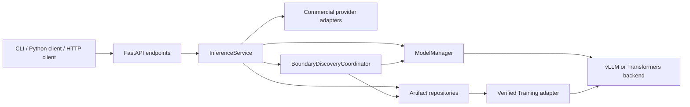
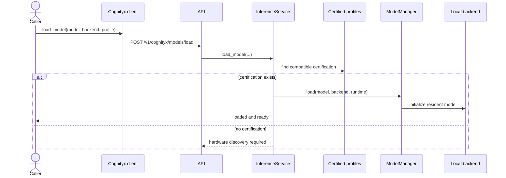
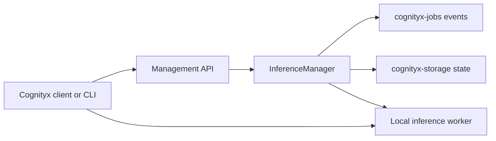
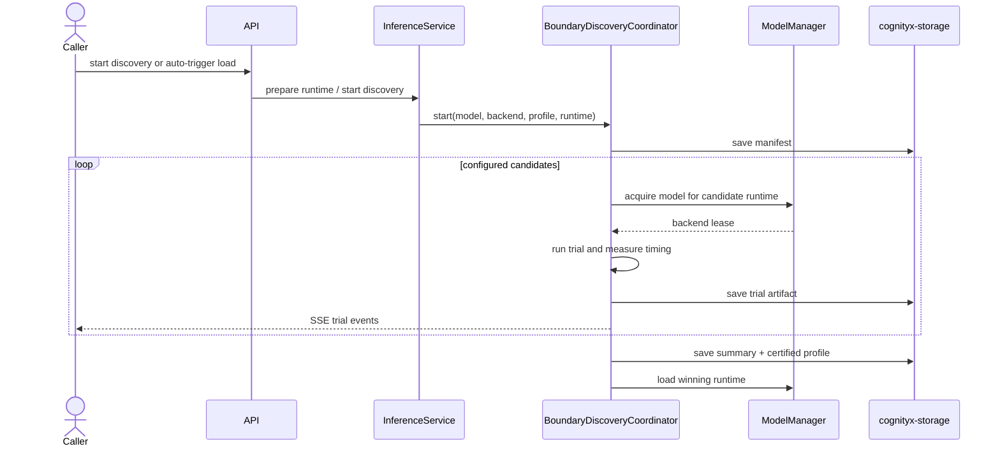
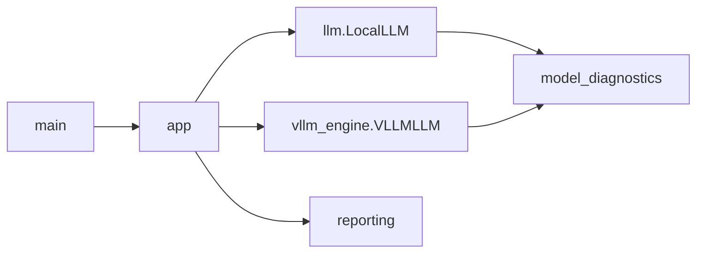
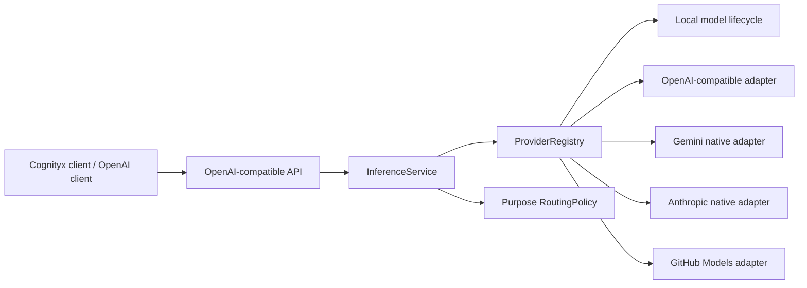

# Architecture blueprint

## Repository shape

This repository now contains two related but distinct layers:

- `cognityx_inference`
  The reusable inference platform used by other Cognityx services.
- `llm_benchmark`
  The preserved interactive benchmark and diagnostics capability.

## Platform execution flow

`InferenceService` is the orchestration center. It decides whether a request
goes to a provider adapter or a locally managed model, and it centralizes
artifact persistence plus context/certification resolution.

For research adapters, Storage first resolves the public Training manifest and
verifies every immutable file. The service compares that manifest with the
actual resident base identity before the backend sees it. vLLM then applies one
adapter to a request without treating it as another full resident model. The
[adapter handoff guide](adapter-handoff.md) describes paired publication and
the boundary with DataForge, Training, MLflow, and Evaluator.

## Local lifecycle flow

The key idea is that load-time residency is defined by model, backend, and
runtime identity. Sampling parameters are request-scoped and do not define the
resident model identity.

## Manager and worker processes

The lightweight `InferenceManager` is a separate control process. It remains
available while the heavyweight worker is stopped and manages one local worker
in this release.

The manager persists only secret-free state: server/job identity, named
profile, model/backend, state, PID/process group, worker URL, timestamps, and a
categorical failure. It never returns the worker command, environment, or
credentials. Startup is single-flight for a profile, so concurrent callers
share one job. Stop first requests graceful process-group termination and then
uses a bounded force fallback.

The worker still uses the existing `InferenceService`, certified-profile
repository, `ModelManager`, leases, and vLLM/Transformers backends. The manager
does not duplicate those responsibilities.

## Discovery flow

This is the operational bridge between boundary evaluation and ordinary
inference use.

## Control surfaces

The current primary surfaces are:

- `cognityx-inference serve`
- `cognityx-inference model ...`
- `cognityx-inference infer ...`
- `cognityx-inference discovery ...`
- `POST /v1/chat/completions`
- `POST /v1/cognityx/models/load`
- `GET /v1/cognityx/discoveries/{job_id}/events`

## Legacy benchmark flow

The benchmark workflow remains intact and continues to use its own orchestration
and reporting path:

That path still covers interactive prompts, `/benchmark`, long-context corpora,
diagnostics, comparison, and saved benchmark JSON.

## Provider architecture

Provider definitions and model profiles are configuration data. The registry
owns provider state, exact model discovery with a TTL cache, capabilities, and
safe status. Adapters translate transport; they do not decide routing. Parameter
policies reject known unsupported combinations before a commercial request.
The service retains the common request/response contract and represents
unavailable provider information as unavailable rather than estimated.

The local provider remains special only for lifecycle and machine telemetry.
Commercial providers have no load/unload operation and expose only
provider-reported usage and latency. This preserves the existing local model
manager, leases, boundary certification, and `cognityx-storage` paths.
